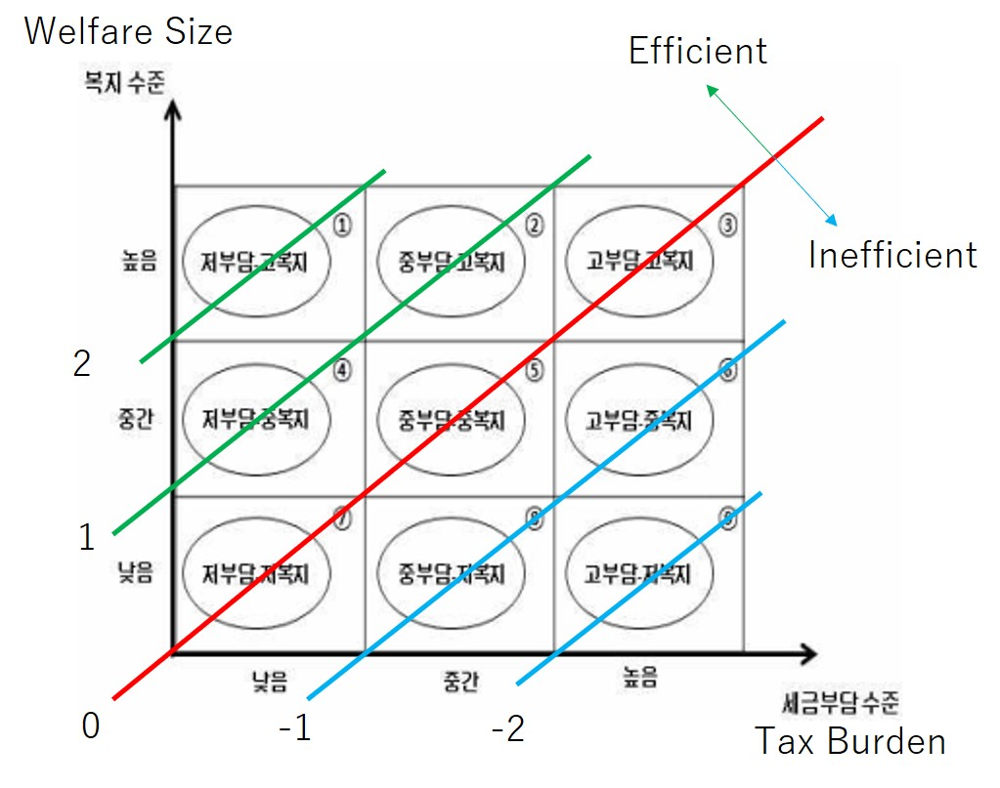

```{r setup, include = FALSE, echo = FALSE}
library(here)
knitr::opts_chunk$set(
  message = FALSE, 
  warning = FALSE, 
  echo = FALSE, 
  cache = FALSE,
  include = FALSE,
  fig.width = 10, fig.height = 6
)
knitr::opts_knit$set(root.dir = here())

library(tidyverse)
library(readstata13)
library(kableExtra)
options(knitr.kable.NA = "")
```

# Introduction
## Background of South Korea Tax Reform

To investigate the price effect, we use the 2014 tax reform in the South Korea.

- Before 2014, tax deduction was adopted to subsidize charitable donation behavior.
- After 2014, tax credit have been adopted.

The main difference is that tax credits reduce taxes directly, while tax deductions indirectly lower the tax burden by decreasing the taxpayer’s marginal tax rate, which increases with gross income

<!--
## Charitable Giving and Governement Policy

There are huge literatures to investigate relationship bewteen chariable giving and governement policies

1. price elasticity of charitable giving using the tax benefit
1. the crowd-out effect of government expenditure

Even though tax benefits directly affect government expenditure,
there is no literature to try to connect the tax benefit with governement expenditure as far as we know.

We investigate the price effect and the crowd-out effect simultaneously,
and connect two effects through political trust.

## Why Political Trust?

We conjecture that the political trust is key driver to determine the price effect and the crowd-out effect 

- Price effect: If people untrust politicians, then they may also suspect the system of tax banefit. If people trust politicians sufficiently, then they may try to send money to government. Thus, they do not use the tax benefit which decreases governement's revenue.
- Crowd-out effect: If people untrust politicians, then they may expect that governement does not invest the public goods. This is related with the strategic uncertainty.
-->

# Data
## National Survey of Tax and Benefit (NaSTaB)

- The Korea Institute of Taxation and Finance implements the financial panel survey to study the tax burden of households and the benefits that households receive from goverment.
- The subjects of this survey are general household and household members living in 15 cities and provinces nationwide.
- This survey is based on a face-to-face interview. If it is difficult for investigators to meet subjects, another family member answers on behalf of him.
- Survey items: Annual taxable income (last year), charitable donations (last year), trust for politicians (5-Likert scale), and other covariates (age, education, gender etc.).
- Survey period: 2008 ~ 2019
    - We use survey data after 2013 to focus on tax policy change in 2014.

```{stata dataset, collectcode=TRUE, results = "hide", eval = FALSE}
cd "C:\Users\vge00\Desktop\nastab"  //root path

** ---- ReadData
use "data\shaped.dta", clear

gen price = .
replace price = 1 - mtr if year < 2014
replace price = 1 - 0.15 if year >= 2014
gen log_price = ln(price)
gen log_total_g = ln(i_total_giving + 1)
gen log_pinc_all = ln(lincome + 100000)
replace gender = gender - 1
gen univ = (educ == 3) if !missing(educ)
gen highschool = (educ == 2) if !missing(educ)
gen juniorhigh = (educ == 1) if !missing(educ)
gen sqage = age^2/100

** ---- LagOperation
tsset pid year

forvalues k = 1(1)3 {
  gen diff`k'G = log_total_g - l`k'.log_total_g
	gen diff`k'G1 = i_ext_giving - l`k'.i_ext_giving
	gen diff`k'p = log_price - l`k'.log_price
	gen diff`k'I = log_pinc_all - l`k'.log_pinc_all
	gen diff`k'_age = age - l`k'.age
	gen diff`k'_sqage = sqage - l`k'.sqage
}

keep if year >= 2012

** ---- ConstructTaxBalance
gen now_welfare = 1
replace now_welfare = 2 if avg_welfare_tax < 3 & avg_welfare_tax <= 6
replace now_welfare = 3 if avg_welfare_tax <= 3
replace now_welfare = . if missing(avg_welfare_tax)

gen now_tax = 1
replace now_tax = 2 if avg_welfare_tax == 2 | avg_welfare_tax == 5 | avg_welfare_tax == 8
replace now_tax = 3 if avg_welfare_tax == 3 | avg_welfare_tax == 6 | avg_welfare_tax == 9
replace now_tax = . if missing(avg_welfare_tax)

gen now_balance = 0
replace now_balance = 2 if avg_welfare_tax == 1
replace now_balance = 1 if avg_welfare_tax == 2 | avg_welfare_tax == 4
replace now_balance = -1 if avg_welfare_tax == 6 | avg_welfare_tax == 8
replace now_balance = -2 if avg_welfare_tax == 9
replace now_balance = . if missing(avg_welfare_tax)

gen now_balance3 = 0
replace now_balance3 = 1 if now_balance > 0
replace now_balance3 = -1 if now_balance < 0
replace now_balance3 = . if missing(now_balance)
```

## Time Series of Chariable Giving

```{stata SummaryOutcome, results = "hide", eval = FALSE}
frame copy default avgdt
frame avgdt: by year, sort: egen meanext = mean(i_ext_giving)
frame avgdt: by year, sort: egen meanint = mean(i_total_giving) if i_ext_giving == 1
frame avgdt: keep year meanext meanint
frame avgdt: duplicates drop
frame avgdt: keep if meanint != .

frame avgdt: {
    twoway ///
	(bar meanext year, color(gs10) lcolor(black) barwidth(0.9) yaxis(1)) ///
	(connected meanint year, color(blue) yaxis(2)), ///
	xline(2013.5, lcolor(red) lpattern(-)) ///
	yscale(range(0 .) axis(1)) ///
	yscale(range(0 .) axis(2)) ///
	ylabel(0(.05).2, axis(1)) ///
	ylabel(0(50)200, axis(2)) ///
	ytitle("Proportion of donors", axis(1)) ///
	ytitle("Average donations among donors", axis(2)) ///
	xlabel(2012(1)2018) xtitle("Year")  ///
	legend(label(1 "Extensive margin") label(2 "Intensive margin")) ///
	graphregion(fcolor(white))

  graph export "_assets/SummaryOutcome.pdf", replace
}
```

```{r, include = TRUE, out.width="90%", fig.cap="Proportion of Donors and Average Donations among Donors"}
knitr::include_graphics(paste(here(), "_assets/SummaryOutcome.pdf", sep= "/"))
```

## Summary Statistics of Covariates

```{stata SummaryCovariate, results = "hide", eval = FALSE}
matrix sumcov = J(7, 7, .)

label variable gender "Female"
label variable age "Age"
label variable lincome "Annual taxable income"
label variable univ "University graduate"
label variable highschool "High School Graduate"
label variable pid "#.Respondents"
label variable hhid "#.Households"

local j = 0
foreach v in gender age lincome univ highschool {
    local k = 1
	local j = `++j'
	di "j = `j'"
	forvalues y = 2012(1)2018 {
	    di "k = `k'"
		summarize `v' if year == `y'
		matrix sumcov[`j',`k'] = r(mean)
		local k = `++k'
	}
}

local k = 1
forvalues y = 2012(1)2018 {
    di = "k = `k'"
	summarize pid if year == `y'
	matrix sumcov[6, `k'] = r(N)
	local k = `++k'
}

frame copy default temp
frame temp: keep year hhid
frame temp: duplicates drop
local k = 1
forvalues y = 2012(1)2018 {
    di = "k = `k'"
	frame temp: summarize hhid if year == `y'
	matrix sumcov[7, `k'] = r(N)
	local k = `++k'
}

matrix rownames sumcov = gender age lincome univ highschool pid hhid 
xsvmat sumcov, saving(_assets/SummaryCovariate.dta) rownames(xvar)
```

```{r shapeSummaryCovariate}
tabsum <- read.dta13("_assets/SummaryCovariate.dta") %>% data.frame()
tabsum <- tabsum %>% 
	mutate_at(vars(-xvar), 
		list(
			~case_when(
				xvar == "pid" | xvar == "hhid" ~ sprintf("%1d", as.integer(.)),
				TRUE ~ sprintf("%1.2f", .)
			)
		)
	) %>% 
	mutate(
		xvar = recode(
			xvar,
			"gender" = "Female",
			"age" = "Age",
			"lincome" = "Annual taxable income",
			"univ" = "University graduate",
			"highschool" = "High school graduate",
			"pid" = "#.Respondents",
			"hhid" = "#.Households" 
		)
	)
```

```{r kableSummaryCovariate, include=TRUE}
knitr::kable(
    tabsum[,1:5],
    format = "latex",
    caption = "Summary Statistics of Covariates",
    col.names = c("", "2012", "2013", "2014", "2015"),
    row.names = FALSE,
    align = "lccccccc", 
    booktabs = TRUE, escape = TRUE, linesep = ""
) %>% 
kable_styling() 
```

## Summary Statistics of Covariates (Cont'd)

```{r kableSummaryCovariate2, include=TRUE}
knitr::kable(
    tabsum[,c(1,6:8)],
    format = "latex",
    caption = "Summary Statistics of Covariates (Continued)",
    col.names = c("", "2016", "2017", "2018"),
    row.names = FALSE,
    align = "lccccccc", 
    booktabs = TRUE, escape = TRUE, linesep = ""
) %>% 
kable_styling() 
```


## What is Giving Price?

Consider allocation between private consumptions ($x_i$) and charitable giving ($g_i$).
Let $y_i$ be pre-tax total income.
Then, the budget constraint is 

$$
    x_i + g_i = y_i - T_i(y_i, g_i),
$$

where $T_i$ is tax amount depending on the pre-tax income and charitable giving.

## Determination of Tax Amount

Tax deduction reduces taxable income by giving, that is,

$$
    T_i = \tau(y_i - g_i) \cdot (y_i - g_i),
$$

where $\tau(\cdot)$ is the marginal income tax rate which is determined by $y_i - g_i$.

Tax credit reduces tax amount directly, that is,

$$
    T_i = \tau(y_i)\cdot y_i - m g_i,
$$

where $m \in [0, 1]$ is the tax credit rate.

## Derive Giving Price

Under the tax deduction system, the budget constraint is 

$$
    x_i + [1 - \tau(y_i - g_i)]g_i = [1 - \tau(y_i - g_i)] y_i.
$$

Thus, the giving price of tax deduction system is $p_i^{d} = 1 - \tau(y_i - g_i)$.

Under the tax credit system, the budget constraint is 

$$
    x_i + (1 - m) g_i = [1 - \tau(y_i)] y_i.
$$

Thus, the giving price of tax credit system is $p_i^c = 1 - m$.

## Construct Giving Price

In the South Korea, the tax policy about charitable giving drastically changed in 2014.

- tax deduction (before 2014): $\text{Price}_i = 1 - \tau(y_i - g_i)$
    - the giving price is endogenous because people can manipulate $\tau(y_i - g_i)$ using the charitable giving $g_i$. Since this problem is caused by *last* donations, we use the giving price applying to the *first* donations (**first price**). The first price is calculate by $\tau(y_i)$ where $y_i$ is the annual taxable income reported in the NaSTaB.
- tax credit (after 2014): $\text{Price}_i = 1 - m$
    - In the South Korea, the tax credit rate determines exogeneity, $m = 0.15$.

## Income Distribution and Giving Price

```{stata SummaryPriceChange, results = "hide", eval = FALSE}
frame copy default sump
frame sump: keep if year == 2013
frame sump: keep lincome price

frame sump: {
    twoway ///
	(line price lincome, yaxis(1) connect(stairstep) sort(lincome) lcolor(blue)) ///
	(histogram lincome, freq yaxis(2) color(gs10%50) lcolor(black)), ///
	yline(0.85, lcolor(red) lpattern(-)) ///
	xline(1200, lcolor(black) lpattern(-))  ///
	xline(4600, lcolor(black) lpattern(-))  ///
	ytitle("Giving Price", axis(1)) ///
	ytitle("Count", axis(2)) ///
	xlabel(1200 4600 8800 30000) ///
	xtitle("Annual taxable income (unit: 10,000KRW)")  ///
	legend(label(1 "Giving Price in 2013")) ///
	graphregion(fcolor(white))

  graph export "_assets/SummaryPriceChange.pdf", replace
}
```

```{r, include = TRUE, out.width="90%", fig.cap="Income Distribution and Giving Price in 2013"}
knitr::include_graphics(paste(here(), "_assets/SummaryPriceChange.pdf", sep= "/"))
```

# Price Elasticity

## Baseline Regressions

Our baseline regression equation is 

$$
    \log(\text{Giving}_{ijt}) = 
    \alpha_i + \beta_1 \log(\text{Price}_{ijt}) + \delta X_{ijt} + \lambda_t + \epsilon_{ijt}.
$$

- $\log(\text{Giving}_{ijt})$ is logarithm of individual $i$'s charitable giving in year $t$.
- $\log(\text{Price}_{ijt})$ is logarithm of individual $i$'s giving price in year $t$.
- $\beta_1$ represents the price elasticity of giving.
- $\alpha_i$ and $\lambda_t$ are individual and time fixed effect, respectively.

```{stata EstimateElasticity, results = "hide", eval = FALSE}
label variable log_price "ln(giving price)"

* baseline
xtreg log_total_g log_price log_pinc_all i.year, fe vce(cluster pid)
mat coef = r(table)["b".."pvalue", "log_price"]
mat colnames coef = model0
mat stat = e(N) \ e(r2_a)
mat colnames stat = model0
mat rownames stat = N r2a
mat_rapp model0 : coef stat
mat tabular = model0'

* with covariates
local cov sqage i.year##i.educ i.year##i.gender i.living_area
local xvars 
local k = 1
foreach v of local cov {
	di "model `k'"
    
	*make set of covariates
	local xvars `xvars' `v'
	
	*estimate fixed effect model
	xtreg log_total_g log_price log_pinc_all i.year age `xvars', fe vce(cluster pid)
	
	*matrix of regression result
	mat coef = r(table)["b".."pvalue","log_price"]
	mat colnames coef = model`k'
	mat stat = e(N) \ e(r2_a)
	mat colnames stat = model`k'
	mat rownames stat = N r2a
	mat_rapp model`k' : coef stat
	mat model`k' = model`k''
	
	*combined with previous results
	mat_rapp tabular : tabular model`k'

	local k = `++k'
}

xsvmat tabular, saving(_assets/EstimateElasticity.dta, replace) rownames(xvar) names(col)
```


## Baseline Regressions: Result

We found the **price effect** of giving (1\% price increase leads to about 1.1\% giving decrease)


```{r shapeEstimateElasticity}
org.basereg <- read.dta13("_assets/EstimateElasticity.dta") %>% data.frame()

coef.basereg <- org.basereg %>% 
	mutate(
		b = case_when(
			pvalue <= 0.01 ~ sprintf("%1.3f***", b),
			pvalue <= 0.05 ~ sprintf("%1.3f**", b),
			pvalue <= 0.1 ~ sprintf("%1.3f*", b),
			TRUE ~ sprintf("%1.3f", b)
		),
		se = sprintf("(%1.3f)", se)
	) %>% 
	select(xvar, b, se) %>% 
	pivot_longer(-xvar, values_to = "value", names_to = "stat") %>% 
	pivot_wider(values_from = "value", names_from = "xvar") %>% 
	select(-stat) %>% 
	cbind(xvar = c("ln(giving price)", ""), .)

stat.basereg <- org.basereg %>% select(N) %>% unlist() %>% c("N", .)

addline <- rbind(
  c("Logged Income", "Y", "Y", "Y", "Y", "Y"),
  c("Age", "N", "Y", "Y", "Y", "Y"),
  c("Year X Educ", "N", "N", "Y", "Y", "Y"),
  c("Year X Gender", "N", "N", "N", "Y", "Y"),
  c("Resident Area", "N", "N", "N", "N", "Y")
)

tab.basereg <- rbind(as.matrix(coef.basereg), addline) %>% 
	rbind(stat.basereg) %>% 
	data.frame()
```

```{r kableEstimateElasticity, include = TRUE}
knitr::kable(
    tab.basereg,
    format = "latex",
    caption = "Baseline Regressions",
    col.names = c("", "(1)", "(2)", "(3)", "(4)", "(5)"),
    row.names = FALSE,
    align = "lccccc", 
    booktabs = TRUE, escape = TRUE, linesep = ""
) %>% 
kable_styling(font_size = 9)
```

## Intensive Margin and Extensive Margin

Let $D_{ijt}$ be a dummy variable taking 1 if individual $i$ whose resident area $j$ in year $t$ donate in year $t$

- Intensive margin: Estiamte $\beta_1$ where outcome variable is $\log(\text{Giving}_{ijt})$, using units with $D_{ijt} = 1$.
- Extensive margin: Estimate $\beta_1$ where outcome variable is $D_{ijt}$.
	- Extensive-margin price elasticity can be calculated by $\beta_1/\bar{D}$ where $\bar{D}$ is the sample mean of $D_{ijt}$.

Covariates in each column corresponds to a column in a previous slide.

```{stata EstimateElasticityIntensive, results = "hide", eval = FALSE}
label variable log_price "ln(giving price)"

* baseline
xtreg log_total_g log_price log_pinc_all i.year if i_ext_giving == 1, fe vce(cluster pid)
mat coef = r(table)["b".."pvalue", "log_price"]
mat colnames coef = model0
mat stat = e(N) \ e(r2_a)
mat colnames stat = model0
mat rownames stat = N r2a
mat_rapp model0 : coef stat
mat tabular = model0'

* with covariates
local cov sqage i.year##i.educ i.year##i.gender i.living_area
local xvars 
local k = 1
foreach v of local cov {
	di "model `k'"
    
	*make set of covariates
	local xvars `xvars' `v'
	
	*estimate fixed effect model
	xtreg log_total_g log_price log_pinc_all i.year age `xvars' if i_ext_giving == 1, /// 
		fe vce(cluster pid)
	
	*matrix of regression result
	mat coef = r(table)["b".."pvalue","log_price"]
	mat colnames coef = model`k'
	mat stat = e(N) \ e(r2_a)
	mat colnames stat = model`k'
	mat rownames stat = N r2a
	mat_rapp model`k' : coef stat
	mat model`k' = model`k''
	
	*combined with previous results
	mat_rapp tabular : tabular model`k'

	local k = `++k'
}


xsvmat tabular, saving(_assets/EstimateElasticityIntensive.dta, replace) rownames(xvar) names(col)
```

```{stata EstimateElasticityExtensive, results = "hide", eval = FALSE}
label variable log_price "ln(giving price)"

* baseline
xtreg i_ext_giving log_price log_pinc_all i.year, fe vce(cluster pid)
mat coef = r(table)["b".."pvalue", "log_price"]
mat colnames coef = model0
mat stat = e(N) \ e(r2_a)
mat colnames stat = model0
mat rownames stat = N r2a

* proportion of donors
summarize i_ext_giving
local mu = r(mean)

* implied elasticity
lincom log_price*(1/`mu')
mat elas = r(estimate) \ r(se) \ ttail(r(df), abs(r(estimate)/r(se)))*2
mat colnames elas = model0
mat rownames elas = e_b e_se e_pval

* baseline result
mat_rapp model0 : coef stat
mat_rapp model0 : model0 elas
mat tabular = model0'

* with covariates
local cov sqage i.year##i.educ i.year##i.gender i.living_area
local xvars 
local k = 1
foreach v of local cov {
	di "model `k'"
    
	*make set of covariates
	local xvars `xvars' `v'
	
	*estimate fixed effect model
	xtreg i_ext_giving log_price log_pinc_all i.year age `xvars', fe vce(cluster pid)
	
	*matrix of regression result
	mat coef = r(table)["b".."pvalue","log_price"]
	mat colnames coef = model`k'
	mat stat = e(N) \ e(r2_a)
	mat colnames stat = model`k'
	mat rownames stat = N r2a
	
	*proportion of donors
	summarize i_ext_giving
	local mu = r(mean)
	
	*implied elasticity
	lincom log_price*(1/`mu')
	mat elas = r(estimate) \ r(se) \ ttail(r(df), abs(r(estimate)/r(se)))*2
	mat colnames elas = model`k'
	mat rownames elas = e_b e_se e_pval
	
	*regression result
	mat_rapp model`k' : coef stat
	mat_rapp model`k' : model`k' elas
	mat model`k' = model`k''
	
	*combined with previous results
	mat_rapp tabular : tabular model`k'

	local k = `++k'
}

xsvmat tabular, saving(_assets/EstimateElasticityExtensive.dta, replace) rownames(xvar) names(col)
```

## Intensive Margin and Extensive Margin: Result

```{r shapeEstimateElasticityIntExt}
org.basereg <- list(
	intensive = read.dta13("_assets/EstimateElasticityIntensive.dta") %>% data.frame(),
	extensive = read.dta13("_assets/EstimateElasticityExtensive.dta") %>% data.frame()
)

coef.basereg <- org.basereg %>% 
	purrr::map(function(x)
		x %>% 
		mutate(
			b = case_when(
				pvalue <= 0.01 ~ sprintf("%1.3f***", b),
				pvalue <= 0.05 ~ sprintf("%1.3f**", b),
				pvalue <= 0.1 ~ sprintf("%1.3f*", b),
				TRUE ~ sprintf("%1.3f", b)
			),
			se = sprintf("(%1.3f)", se),
			N = sprintf("%1d", N)
		) %>% 
		select(xvar, b, se, N) %>% 
		pivot_longer(-xvar, values_to = "value", names_to = "stat") %>% 
		pivot_wider(values_from = "value", names_from = "xvar") %>% 
		select(-stat) %>% 
		cbind(xvar = c("ln(giving price)", "", ""), .)
	) %>% 
	reduce(rbind)
	

elas.basereg <- org.basereg$extensive %>% 
	mutate(
		e_b = case_when(
			e_pval <= 0.01 ~ sprintf("%1.3f***", e_b),
			e_pval <= 0.05 ~ sprintf("%1.3f**", e_b),
			e_pval <= 0.1 ~ sprintf("%1.3f*", e_b),
			TRUE ~ sprintf("%1.3f", e_b)
		),
		e_se = sprintf("(%1.3f)", e_se)
	) %>% 
	select(xvar, e_b, e_se) %>% 
	pivot_longer(-xvar, values_to = "value", names_to = "stat") %>% 
	pivot_wider(values_from = "value", names_from = "xvar") %>% 
	select(-stat) %>% 
	cbind(xvar = c("Elasticity", ""), .)

tab.basereg <- rbind(coef.basereg[-6,], elas.basereg) %>% rbind(coef.basereg[6,])
```

```{r kableEstimateElasticityIntExt, include = TRUE}
knitr::kable(
    tab.basereg,
    format = "latex",
    caption = "Intensive-margin and Extensive-Margin Price Elasticity",
    col.names = c("", "(1)", "(2)", "(3)", "(4)", "(5)"),
    row.names = FALSE,
    align = "lccccc", 
    booktabs = TRUE, escape = TRUE, linesep = ""
) %>% 
kable_styling(font_size = 8) %>% 
pack_rows("Intensive Margin", 1, 3) %>% 
pack_rows("Extensive Margin", 4, 6)
```

## Robustness Check

1. Income and donations are determined simultaneously
1. Effect of presidential transition on donation behavior
1. Last price elasticity
1. Self-selection of receiving tax benefit
1. Transitory and permanent elasticity

## Robustness Check 1

First potential concern: Income and donations are determined simultaneously
    
- This causes both a change of giving price and a change of an amount of donations
- Gruber and Saez (2002) provided that we should use $\log(\text{Price}_{ijt}/\text{Price}_{ij(t-k)})$ as an insturment.
- We estimated the model (5) in the previous slide, using the panel IV model for $k = 1, 2, 3$.
	- Note that Alumnia (2020) took a strategy of $k$-difference model.


```{stata PanelIVEstimateElasticity, results = "hide", eval = FALSE}
forvalues k = 1(1)3 {
    
	di "lag = `k'"
	
	* first stage 
    xtreg log_price diff`k'p log_pinc_all age i.living_area i.year##i.gender i.year##i.educ, ///
		fe vce(cluster pid)
	
	* result of first stage
	mat fstage = r(table)["b".."pvalue","diff`k'p"]
	mat fstage = fstage[1,1] \ fstage[3,1]^2
	mat colnames fstage = model`k'
	mat rownames fstage = ivcoef ivf
	
	* second stage
	xtivreg log_total_g log_pinc_all age i.living_area i.year##i.gender i.year##i.educ ///
		(log_price = diff`k'p), fe vce(cluster pid)
	
	* result of second stage
	mat coef = r(table)["b".."pvalue","log_price"]
	mat colnames coef = model`k'
	mat stat = e(N) \ e(r2_w)
	mat colnames stat = model`k'
	mat rownames stat = N r2w
	mat_rapp model`k' : coef stat
	
	* combined with first stage result
	mat_rapp model`k' : model`k' fstage
	mat model`k' = model`k''
}

mat_rapp tabular : model1 model2
mat_rapp tabular : tabular model3

xsvmat tabular, saving(_assets/PanelIVEstimateElasticity.dta, replace) rownames(xvar) names(col)
```

```{stata PanelIVEstimateElasticityExtensive, results = "hide", eval = FALSE}
forvalues k = 1(1)3 {
    
	di "lag = `k'"
	
	* first stage 
    xtreg log_price diff`k'p log_pinc_all age i.living_area i.year##i.gender i.year##i.educ, ///
		fe vce(cluster pid)
	
	* result of first stage
	mat fstage = r(table)["b".."pvalue","diff`k'p"]
	mat fstage = fstage[1,1] \ fstage[3,1]^2
	mat colnames fstage = model`k'
	mat rownames fstage = ivcoef ivf
	
	* second stage
	xtivreg i_ext_giving log_pinc_all age i.living_area i.year##i.gender i.year##i.educ ///
		(log_price = diff`k'p), fe vce(cluster pid)
	
	* result of second stage
	mat coef = r(table)["b".."pvalue","log_price"]
	mat colnames coef = model`k'
	mat stat = e(N) \ e(r2_w)
	mat colnames stat = model`k'
	mat rownames stat = N r2w
	
	*proportion of donors
	summarize i_ext_giving
	local mu = r(mean)
	
	*implied elasticity
	lincom log_price*(1/`mu')
	mat elas = r(estimate) \ r(se) \ (1 - normal(abs(r(estimate)/r(se))))*2
	mat colnames elas = model`k'
	mat rownames elas = e_b e_se e_pval
	
	* combined with results
	mat_rapp model`k' : coef stat
	mat_rapp model`k' : model`k' elas
	mat_rapp model`k' : model`k' fstage
	mat model`k' = model`k''

}

mat_rapp tabular : model1 model2
mat_rapp tabular : tabular model3

xsvmat tabular, saving(_assets/PanelIVEstimateElasticityExtensive.dta, replace) rownames(xvar) names(col)
```

```{stata PanelIVEstimateElasticityIntensive, results = "hide", eval = FALSE}
forvalues k = 1(1)3 {
    
	di "lag = `k'"
	
	* first stage 
    xtreg log_price diff`k'p log_pinc_all age i.living_area i.year##i.gender i.year##i.educ ///
		if i_ext_giving == 1, fe vce(cluster pid)
	
	* result of first stage
	mat fstage = r(table)["b".."pvalue","diff`k'p"]
	mat fstage = fstage[1,1] \ fstage[3,1]^2
	mat colnames fstage = model`k'
	mat rownames fstage = ivcoef ivf
	
	* second stage
	xtivreg log_total_g log_pinc_all age i.living_area i.year##i.gender i.year##i.educ ///
		(log_price = diff`k'p) if i_ext_giving == 1, fe vce(cluster pid)
	
	* result of second stage
	mat coef = r(table)["b".."pvalue","log_price"]
	mat colnames coef = model`k'
	mat stat = e(N) \ e(r2_w)
	mat colnames stat = model`k'
	mat rownames stat = N r2w
	mat_rapp model`k' : coef stat
	
	* combined with first stage result
	mat_rapp model`k' : model`k' fstage
	mat model`k' = model`k''
}

mat_rapp tabular : model1 model2
mat_rapp tabular : tabular model3

xsvmat tabular, saving(_assets/PanelIVEstimateElasticityIntensive.dta, replace) rownames(xvar) names(col)
```


## Robustness Check 1: Result

```{r shapePanelIVEstimateElasticity}
org.pivreg <- read.dta13("_assets/PanelIVEstimateElasticity.dta") %>% data.frame()

coef.pivreg <- org.pivreg %>% 
	select(xvar, b, se, pvalue) %>% 
	mutate(
		b = case_when(
			pvalue <= 0.01 ~ sprintf("%1.3f***", b),
			pvalue <= 0.05 ~ sprintf("%1.3f**", b),
			pvalue <= 0.1 ~ sprintf("%1.3f*", b),
			TRUE ~ sprintf("%1.3f", b)
		),
		se = sprintf("(%1.3f)", se)
	) %>% 
	select(xvar, b, se) %>% 
	pivot_longer(-xvar, values_to = "value", names_to = "stat") %>% 
	pivot_wider(values_from = "value", names_from = "xvar") %>% 
	select(-stat) %>% 
	cbind(xvar = c("ln(giving price)", ""), .)

stat.pivreg <- org.pivreg %>% 
	select(xvar, ivf, N) %>% 
	mutate(ivf = sprintf("%1.2f", ivf), N = sprintf("%1d", as.integer(N))) %>%
	pivot_longer(-xvar, values_to = "value", names_to = "stat") %>% 
	pivot_wider(values_from = "value", names_from = "xvar") %>% 
	select(-stat) %>% 
	cbind(xvar = c("F-stat of IV", "N"), .)

tab.pivreg <- rbind(coef.pivreg, stat.pivreg)
```

```{r kablePanelIVEstimateElasticity, include = TRUE}
knitr::kable(
    tab.pivreg,
    format = "latex",
    caption = "Panel IV Regressions",
    col.names = c("", "k = 1", "k = 2", "k = 3"),
    row.names = FALSE,
    align = "lccc", 
    booktabs = TRUE, escape = TRUE, linesep = ""
) %>% 
kable_styling()
```

## Robustness Check 1: Intensive and Extensive Margin

```{r shapePanelIVEstimateElasticityIntExt}
org.pivreg <- list(
	intensive = read.dta13("_assets/PanelIVEstimateElasticityIntensive.dta") %>% data.frame(),
	extensive = read.dta13("_assets/PanelIVEstimateElasticityExtensive.dta") %>% data.frame()
)

coef.pivreg <- org.pivreg %>% 
	purrr::map(function(x)
		x %>% 
		select(xvar, b, se, pvalue, ivf, N) %>% 
		mutate(
			b = case_when(
				pvalue <= 0.01 ~ sprintf("%1.4f***", b),
				pvalue <= 0.05 ~ sprintf("%1.4f**", b),
				pvalue <= 0.1 ~ sprintf("%1.4f*", b),
				TRUE ~ sprintf("%1.4f", b)
			),
			se = sprintf("(%1.4f)", se),
			ivf = sprintf("%1.2f", ivf), N = sprintf("%1d", as.integer(N))
		) %>% 
		select(xvar, b, se, ivf, N) %>% 
		pivot_longer(-xvar, values_to = "value", names_to = "stat") %>% 
		pivot_wider(values_from = "value", names_from = "xvar") %>% 
		select(-stat) %>% 
		cbind(xvar = c("ln(giving price)", "", "F-stat of IV", "N"), .)
	) %>% 
	reduce(rbind)

elas.pivreg <- org.pivreg$extensive %>% 
	mutate(
		e_b = case_when(
			e_pval <= 0.01 ~ sprintf("%1.3f***", e_b),
			e_pval <= 0.05 ~ sprintf("%1.3f**", e_b),
			e_pval <= 0.1 ~ sprintf("%1.3f*", e_b),
			TRUE ~ sprintf("%1.3f", e_b)
		),
		e_se = sprintf("(%1.3f)", e_se)
	) %>% 
	select(xvar, e_b, e_se) %>% 
	pivot_longer(-xvar, values_to = "value", names_to = "stat") %>% 
	pivot_wider(values_from = "value", names_from = "xvar") %>% 
	select(-stat) %>% 
	cbind(xvar = c("Elasticity", ""), .)

tab.pivreg <- rbind(coef.pivreg[1:6,], elas.pivreg) %>% rbind(coef.pivreg[7:8,])
```

```{r kablePanelIVEstimateElasticityIntExt, include = TRUE}
knitr::kable(
    tab.pivreg,
    format = "latex",
    caption = "Intensive- and Extensive-Margin Price Elasticity: Panel IV",
    col.names = c("", "k = 1", "k = 2", "k = 3"),
    row.names = FALSE,
    align = "lccc", 
    booktabs = TRUE, escape = TRUE, linesep = ""
) %>% 
kable_styling(font_size = 9) %>% 
pack_rows("Intensive Margin", 1, 4) %>% 
pack_rows("Extensive Margin", 5, 10)
```

## Robust Check 2

Second potential concern: The effect of presidential transition on donations 
    
- The presidential transition is one of our major ommited factor to affect both political trust and charitable giving.
- To shed light on this concern, we used data in 2013 and 2014 (President was Park Geun-hye in both years), and estimated the model (5) in the previous slide, using the fixed effect model and the panel IV model for $k = 1, 2, 3$.


```{stata ShortEstimateElasticity, results = "hide", eval = FALSE}
xtreg log_total_g log_price log_pinc_all age i.living_area i.year##i.gender i.year##i.educ ///
	if year == 2013 | year == 2014, fe vce(cluster pid)

mat coef = r(table)["b".."pvalue","log_price"]
mat colnames coef = model0
mat stat = e(N) \ e(r2_w)
mat colnames stat = model0
mat rownames stat = N r2w
mat_rapp model : coef stat
mat tabular = model'

forvalues k = 1(1)3 {
    
	di "lag = `k'"
	
	* first stage 
    xtreg log_price diff`k'p log_pinc_all age i.living_area i.year##i.gender i.year##i.educ ///
		if year == 2013 | year == 2014, fe vce(cluster pid)
	
	* result of first stage
	mat fstage = r(table)["b".."pvalue","diff`k'p"]
	mat fstage = fstage[1,1] \ fstage[3,1]^2
	mat colnames fstage = model`k'
	mat rownames fstage = ivcoef ivf
	
	* second stage
	xtivreg log_total_g log_pinc_all age i.living_area i.year##i.gender i.year##i.educ ///
		(log_price = diff`k'p) if year == 2013 | year == 2014, fe vce(cluster pid)
	
	* result of second stage
	mat coef = r(table)["b".."pvalue","log_price"]
	mat colnames coef = model`k'
	mat stat = e(N) \ e(r2_w)
	mat colnames stat = model`k'
	mat rownames stat = N r2w
	mat_rapp model`k' : coef stat
	
	* combined with first stage result
	mat_rapp model`k' : model`k' fstage
	mat model`k' = model`k''
	mat_rapp tabular : tabular model`k', miss(.)
}


mat list tabular

xsvmat tabular, saving(_assets/ShortEstimateElasticity.dta, replace) rownames(xvar) names(col)
```

```{stata ShortEstimateElasticityExtensive, results = "hide", eval = FALSE}
* baseline
xtreg i_ext_giving log_price log_pinc_all age i.living_area i.year##i.gender i.year##i.educ ///
	if year == 2013 | year == 2014, fe vce(cluster pid)

mat coef = r(table)["b".."pvalue","log_price"]
mat colnames coef = model0
mat stat = e(N) \ e(r2_w)
mat colnames stat = model0
mat rownames stat = N r2w

* proportion of donors
summarize i_ext_giving
local mu = r(mean)

* implied elasticity
lincom log_price*(1/`mu')
mat elas = r(estimate) \ r(se) \ ttail(r(df), abs(r(estimate)/r(se)))*2
mat colnames elas = model0
mat rownames elas = e_b e_se e_pval

mat_rapp model : coef elas
mat_rapp model : model stat
mat tabular = model'

forvalues k = 1(1)3 {
    
	di "lag = `k'"
	
	* first stage 
    xtreg log_price diff`k'p log_pinc_all age i.living_area i.year##i.gender i.year##i.educ ///
		if year == 2013 | year == 2014, fe vce(cluster pid)
	
	* result of first stage
	mat fstage = r(table)["b".."pvalue","diff`k'p"]
	mat fstage = fstage[1,1] \ fstage[3,1]^2
	mat colnames fstage = model`k'
	mat rownames fstage = ivcoef ivf
	
	* second stage
	xtivreg i_ext_giving log_pinc_all age i.living_area i.year##i.gender i.year##i.educ ///
		(log_price = diff`k'p) if year == 2013 | year == 2014, fe vce(cluster pid)
	
	* result of second stage
	mat coef = r(table)["b".."pvalue","log_price"]
	mat colnames coef = model`k'
	mat stat = e(N) \ e(r2_w)
	mat colnames stat = model`k'
	mat rownames stat = N r2w
	
	*proportion of donors
	summarize i_ext_giving
	local mu = r(mean)
	
	*implied elasticity
	lincom log_price*(1/`mu')
	mat elas = r(estimate) \ r(se) \ (1 - normal(abs(r(estimate)/r(se))))*2
	mat colnames elas = model`k'
	mat rownames elas = e_b e_se e_pval
	
	* combined with first stage result
	mat_rapp model`k' : coef elas
	mat_rapp model`k' : model`k' stat
	mat_rapp model`k' : model`k' fstage
	mat model`k' = model`k''
	mat_rapp tabular : tabular model`k', miss(.)
}


mat list tabular

xsvmat tabular, saving(_assets/ShortEstimateElasticityExtensive.dta, replace) rownames(xvar) names(col)
```

```{stata ShortEstimateElasticityIntensive, results = "hide", eval = FALSE}
* baseline
xtreg log_total_g log_price log_pinc_all age i.living_area i.year##i.gender i.year##i.educ ///
	if (year == 2013 | year == 2014) & i_ext_giving == 1, fe vce(cluster pid)

mat coef = r(table)["b".."pvalue","log_price"]
mat colnames coef = model0
mat stat = e(N) \ e(r2_w)
mat colnames stat = model0
mat rownames stat = N r2w
mat_rapp model : coef stat
mat tabular = model'

forvalues k = 1(1)3 {
    
	di "lag = `k'"
	
	* first stage 
    xtreg log_price diff`k'p log_pinc_all age i.living_area i.year##i.gender i.year##i.educ ///
		if (year == 2013 | year == 2014) & i_ext_giving == 1, fe vce(cluster pid)
	
	* result of first stage
	mat fstage = r(table)["b".."pvalue","diff`k'p"]
	mat fstage = fstage[1,1] \ fstage[3,1]^2
	mat colnames fstage = model`k'
	mat rownames fstage = ivcoef ivf
	
	* second stage
	xtivreg log_total_g log_pinc_all age i.living_area i.year##i.gender i.year##i.educ ///
		(log_price = diff`k'p) if (year == 2013 | year == 2014) & i_ext_giving == 1, fe vce(cluster pid)
	
	* result of second stage
	mat coef = r(table)["b".."pvalue","log_price"]
	mat colnames coef = model`k'
	mat stat = e(N) \ e(r2_w)
	mat colnames stat = model`k'
	mat rownames stat = N r2w
	mat_rapp model`k' : coef stat
	
	* combined with first stage result
	mat_rapp model`k' : model`k' fstage
	mat model`k' = model`k''
	mat_rapp tabular : tabular model`k', miss(.)
}


mat list tabular


xsvmat tabular, saving(_assets/ShortEstimateElasticityIntensive.dta, replace) rownames(xvar) names(col)
```


## Robustness Check 2: Result

```{r shapeShortEstimateElasticity}
org.tab <- read.dta13("_assets/ShortEstimateElasticity.dta") %>% data.frame()

shape.tab <- org.tab %>% 
	select(xvar, b, se, pvalue, ivf, N) %>% 
	mutate(
		b = case_when(
			pvalue <= 0.01 ~ sprintf("%1.3f***", b),
			pvalue <= 0.05 ~ sprintf("%1.3f**", b),
			pvalue <= 0.1 ~ sprintf("%1.3f*", b),
			TRUE ~ sprintf("%1.3f", b)
		),
		se = sprintf("(%1.3f)", se),
		ivf = if_else(is.na(ivf), "", sprintf("%1.2f", ivf)), 
		N = sprintf("%1d", as.integer(N))
	) %>% 
	select(xvar, b, se, ivf, N) %>% 
	pivot_longer(-xvar, values_to = "value", names_to = "stat") %>% 
	pivot_wider(values_from = "value", names_from = "xvar") %>% 
	select(-stat) %>% 
	cbind(xvar = c("ln(giving price)", "", "F-stat of IV", "N"), .)
```

```{r kableShortEstimateElasticity, include=TRUE}
knitr::kable(
    shape.tab,
    format = "latex",
    caption = "Results with data in 2013 and 2014",
    col.names = c("", "", "k = 1", "k = 2", "k = 3"),
    row.names = FALSE,
    align = "lcccc", 
    booktabs = TRUE, escape = TRUE, linesep = ""
) %>% 
kable_styling(font_size = 9) %>% 
add_header_above(c(" " = 1, "FE" = 1, "Panel IV with FE" = 3))
```

## Robustness Check 2: Intensive and Extensive Margin

```{r shapeShortEstimateElasticityIntExt}
org.tab <- list(
	intensive = read.dta13("_assets/ShortEstimateElasticityIntensive.dta") %>% data.frame(),
	extensive = read.dta13("_assets/ShortEstimateElasticityExtensive.dta") %>% data.frame()
)

coef.tab <- org.tab %>% 
	purrr::map(function(x)
		x %>% 
		select(xvar, b, se, pvalue, ivf, N) %>% 
		mutate(
			b = case_when(
				pvalue <= 0.01 ~ sprintf("%1.3f***", b),
				pvalue <= 0.05 ~ sprintf("%1.3f**", b),
				pvalue <= 0.1 ~ sprintf("%1.3f*", b),
				TRUE ~ sprintf("%1.3f", b)
			),
			se = sprintf("(%1.3f)", se),
			ivf = if_else(is.na(ivf), "", sprintf("%1.2f", ivf)), 
			N = sprintf("%1d", as.integer(N))
		) %>% 
		select(xvar, b, se, ivf, N) %>% 
		pivot_longer(-xvar, values_to = "value", names_to = "stat") %>% 
		pivot_wider(values_from = "value", names_from = "xvar") %>% 
		select(-stat) %>% 
		cbind(xvar = c("ln(giving price)", "", "F-stat of IV", "N"), .)
	) %>% 
	reduce(rbind)

elas.tab <- org.tab$extensive %>% 
	mutate(
		e_b = case_when(
			e_pval <= 0.01 ~ sprintf("%1.3f***", e_b),
			e_pval <= 0.05 ~ sprintf("%1.3f**", e_b),
			e_pval <= 0.1 ~ sprintf("%1.3f*", e_b),
			TRUE ~ sprintf("%1.3f", e_b)
		),
		e_se = sprintf("(%1.3f)", e_se)
	) %>% 
	select(xvar, e_b, e_se) %>% 
	pivot_longer(-xvar, values_to = "value", names_to = "stat") %>% 
	pivot_wider(values_from = "value", names_from = "xvar") %>% 
	select(-stat) %>% 
	cbind(xvar = c("Elasticity", ""), .)

tab <- rbind(coef.tab[1:6,], elas.tab) %>% rbind(coef.tab[7:8,])
```

```{r kableShortEstimateElasticityIntExt, include=TRUE}
knitr::kable(
    tab,
    format = "latex",
    caption = "Intensive- and Extensive-Margin Price Elasticity with Data in 2013 and 2014",
    col.names = c("", "", "k = 1", "k = 2", "k = 3"),
    row.names = FALSE,
    align = "lcccc", 
    booktabs = TRUE, escape = TRUE, linesep = ""
) %>% 
kable_styling(font_size = 9) %>% 
add_header_above(c(" " = 1, "FE" = 1, "Panel IV with FE" = 3)) %>% 
pack_rows("Intensive Margin", 1, 4) %>% 
pack_rows("Extensive Margin", 5, 10)
```


# Political Trust and Price Elasticity

## Estimation of Trust Index

The trust for politicans is time-varying variable because it depends on governments' policies.
We make time-invarying trust index using the fixed effect model.

$$
    \text{Trust}_{ijt} = \text{Trustid}_{ij} + c_j \cdot \lambda_t + \lambda_t + \epsilon_{ijt}.
$$

- $\text{Trust}_{ijt}$: trust for politicians (5-Likert scale)
- $\text{Trustid}_i$: individual fixed effect (**Trust index**)
- $c_j \cdot \lambda_t$ captures local governments' policies effect
- $\lambda_t$ captures the central government policies effect


```{stata EstimateTrustIndex, results = "hide", eval = FALSE}
xtreg trust_politician i.year##i.living_area if year >= 2015, fe
predict orgtrustid, u

xtreg trust_politician i.year##i.living_area if year == 2015 | year == 2016, fe
predict orgparktrustid, u

xtreg trust_politician i.year##i.living_area if year == 2017 | year == 2018, fe
predict orgmoontrustid, u


* make trustid dataset
frame copy default trustdt
frame trustdt: {
	bysort pid: egen trustid = mean(orgtrustid)
	bysort pid: egen parktrustid = mean(orgparktrustid) 
	bysort pid: egen moontrustid = mean(orgmoontrustid)
}
frame trustdt: keep pid trustid parktrustid moontrustid
frame trustdt: duplicates drop
frame trustdt: gen diff = moontrustid - parktrustid
frame trustdt: xtile original5 = trustid, nq(5) 
frame trustdt: xtile park5 = parktrustid, nq(5)
frame trustdt: xtile original3 = trustid, nq(3)
frame trustdt: xtile park3 = parktrustid, nq(3)
frame trustdt: {
	gen lessdiff1 = 0
	replace lessdiff1 = 1 if abs(diff) < 1
	replace lessdiff1 = . if missing(diff)
}
frame trustdt: {
	gen lessdiffhalf = 0
	replace lessdiffhalf = 1 if abs(diff) < 0.5
	replace lessdiffhalf = . if missing(diff)
}
frame trustdt: save "data\shape\trustid.dta", replace
frame drop trustdt
```

## Histrogram of Trust Index

```{stata HistogramTrustid, results = "hide", eval = FALSE}
frame create trustdt
frame trustdt: use "data\shape\trustid.dta", clear

frame trustdt: {
	twoway ///
	(histogram trustid, freq yaxis(2) color(gs10%50) lcolor(black)), ///
	xtitle("Trust index") ///
	graphregion(fcolor(white))
	
	graph export "_assets/HistogramTrustid.pdf", replace
}
```

```{r, include = TRUE, out.width="90%", fig.cap="Histogram of Trust Index"}
knitr::include_graphics(paste(here(), "_assets/HistogramTrustid.pdf", sep= "/"))
```

## Heterogenous Price Elasticity by Political Trust

To see the heterogenous price elasticity by political trust,
We estimated the baseline regression model (5) (see Table \ref{tab:kableEstimateElasticity}),
using sample grouped by the trust index.

- Five quantile groups: we divide units $i$ into the first, second, third, fourth, and fifth quantile of trust index (1Q, 2Q, 3Q, 4Q, and 5Q, respectively).
- Three quantile groups: we divide units $i$ into the first, second, and third quantile of trust index (1Q, 2Q, and 3Q, respectively).

```{stata EstimateElasticityByTrustGroup, results = "hide", eval = FALSE}
merge m:1 pid using "data\shape\trustid.dta"
drop _merge

forvalues i = 1(1)5 {
    
	* subgroup regression
	xtreg log_total_g log_price log_pinc_all age i.living_area i.year##i.gender i.year##i.educ ///
		if original5 == `i', fe vce(cluster pid)
	
	*matrix of regression result
	mat coef = r(table)["b".."pvalue","log_price"]
	mat colnames coef = model`i'
	mat stat = e(N) \ e(r2_a)
	mat colnames stat = model`i'
	mat rownames stat = N r2a
	mat_rapp model`i' : coef stat
	mat model`i' = model`i''
	
	if `i' == 1 {
	    mat tabular = model`i'
	}
	else {
	    mat_rapp tabular : tabular model`i'
	}
	
}

mat list tabular

xsvmat tabular, saving(_assets/EstimateElasticityByTrustGroup.dta, replace) rownames(xvar) names(col)
```

```{stata EstimateElasticityExtensiveByTrustGroup, results = "hide", eval = FALSE}
merge m:1 pid using "data\shape\trustid.dta"
drop _merge

forvalues i = 1(1)5 {
    
	* subgroup regression
	xtreg i_ext_giving log_price log_pinc_all age i.living_area i.year##i.gender i.year##i.educ ///
		if original5 == `i', fe vce(cluster pid)
	
	*matrix of regression result
	mat coef = r(table)["b".."pvalue","log_price"]
	mat colnames coef = model`i'
	mat stat = e(N) \ e(r2_a)
	mat colnames stat = model`i'
	mat rownames stat = N r2a
	
	* proportion of donors
	summarize i_ext_giving if original5 == `i'
	local mu = r(mean)

	* implied elasticity
	lincom log_price*(1/`mu')
	mat elas = r(estimate) \ r(se) \ ttail(r(df), abs(r(estimate)/r(se)))*2
	mat colnames elas = model`i'
	mat rownames elas = e_b e_se e_pval
	
	* regression result for original5 == i
	mat_rapp model`i' : coef elas
	mat_rapp model`i' : model`i' stat
	mat model`i' = model`i''
	
	* combined with previous results
	if `i' == 1 {
	    mat tabular = model`i'
	}
	else {
	    mat_rapp tabular : tabular model`i'
	}
	
}

mat list tabular
xsvmat tabular, saving(_assets/EstimateElasticityExtensiveByTrustGroup.dta, replace) rownames(xvar) names(col)
```

```{stata EstimateElasticityIntensiveByTrustGroup, results = "hide", eval = FALSE}
merge m:1 pid using "data\shape\trustid.dta"
drop _merge

forvalues i = 1(1)5 {
    
	* subgroup regression
	xtreg log_total_g log_price log_pinc_all age i.living_area i.year##i.gender i.year##i.educ ///
		if original5 == `i' & i_ext_giving == 1, fe vce(cluster pid)
	
	*matrix of regression result
	mat coef = r(table)["b".."pvalue","log_price"]
	mat colnames coef = model`i'
	mat stat = e(N) \ e(r2_a)
	mat colnames stat = model`i'
	mat rownames stat = N r2a
	mat_rapp model`i' : coef stat
	mat model`i' = model`i''
	
	if `i' == 1 {
	    mat tabular = model`i'
	}
	else {
	    mat_rapp tabular : tabular model`i'
	}
	
}

mat list tabular

xsvmat tabular, saving(_assets/EstimateElasticityIntensiveByTrustGroup.dta, replace) rownames(xvar) names(col)
```


```{stata EstimateElasticityByTrustGroup3, results = "hide", eval = FALSE}
merge m:1 pid using "data\shape\trustid.dta"
drop _merge

forvalues i = 1(1)3 {
    
	* subgroup regression
	xtreg log_total_g log_price log_pinc_all age i.living_area i.year##i.gender i.year##i.educ ///
		if original3 == `i', fe vce(cluster pid)
	
	*matrix of regression result
	mat coef = r(table)["b".."pvalue","log_price"]
	mat colnames coef = model`i'
	mat stat = e(N) \ e(r2_a)
	mat colnames stat = model`i'
	mat rownames stat = N r2a
	mat_rapp model`i' : coef stat
	mat model`i' = model`i''
	
	if `i' == 1 {
	    mat tabular = model`i'
	}
	else {
	    mat_rapp tabular : tabular model`i'
	}
	
}

mat list tabular

xsvmat tabular, saving(_assets/EstimateElasticityByTrustGroup3.dta, replace) rownames(xvar) names(col)
```

```{stata EstimateElasticityExtensiveByTrustGroup3, results = "hide", eval = FALSE}
merge m:1 pid using "data\shape\trustid.dta"
drop _merge

forvalues i = 1(1)3 {
    
	* subgroup regression
	xtreg i_ext_giving log_price log_pinc_all age i.living_area i.year##i.gender i.year##i.educ ///
		if original3 == `i', fe vce(cluster pid)
	
	*matrix of regression result
	mat coef = r(table)["b".."pvalue","log_price"]
	mat colnames coef = model`i'
	mat stat = e(N) \ e(r2_a)
	mat colnames stat = model`i'
	mat rownames stat = N r2a
	
	* proportion of donors
	summarize i_ext_giving if original5 == `i'
	local mu = r(mean)

	* implied elasticity
	lincom log_price*(1/`mu')
	mat elas = r(estimate) \ r(se) \ ttail(r(df), abs(r(estimate)/r(se)))*2
	mat colnames elas = model`i'
	mat rownames elas = e_b e_se e_pval
	
	* regression result for original5 == i
	mat_rapp model`i' : coef elas
	mat_rapp model`i' : model`i' stat
	mat model`i' = model`i''
	
	* combined with previous results
	if `i' == 1 {
	    mat tabular = model`i'
	}
	else {
	    mat_rapp tabular : tabular model`i'
	}
	
}

mat list tabular
xsvmat tabular, saving(_assets/EstimateElasticityExtensiveByTrustGroup3.dta, replace) rownames(xvar) names(col)
```

```{stata EstimateElasticityIntensiveByTrustGroup3, results = "hide", eval = FALSE}
merge m:1 pid using "data\shape\trustid.dta"
drop _merge

forvalues i = 1(1)3 {
    
	* subgroup regression
	xtreg log_total_g log_price log_pinc_all age i.living_area i.year##i.gender i.year##i.educ ///
		if original3 == `i' & i_ext_giving == 1, fe vce(cluster pid)
	
	*matrix of regression result
	mat coef = r(table)["b".."pvalue","log_price"]
	mat colnames coef = model`i'
	mat stat = e(N) \ e(r2_a)
	mat colnames stat = model`i'
	mat rownames stat = N r2a
	mat_rapp model`i' : coef stat
	mat model`i' = model`i''
	
	if `i' == 1 {
	    mat tabular = model`i'
	}
	else {
	    mat_rapp tabular : tabular model`i'
	}
	
}

mat list tabular


xsvmat tabular, saving(_assets/EstimateElasticityIntensiveByTrustGroup3.dta, replace) rownames(xvar) names(col)
```


## Five Quantile Groups: Result

```{r shapeEstimateElasticityByTrustGroup}
tabset <- list(
	overall = read.dta13("_assets/EstimateElasticityByTrustGroup.dta") %>% data.frame(),
	intensive = read.dta13("_assets/EstimateElasticityIntensiveByTrustGroup.dta") %>% data.frame(),
	extensive = read.dta13("_assets/EstimateElasticityExtensiveByTrustGroup.dta") %>% data.frame()
)

coeftab <- tabset %>% 
	purrr::map(function(x)
		x %>% 
		select(xvar, b, se, pvalue, N) %>% 
		mutate(
			b = case_when(
				pvalue <= 0.01 ~ sprintf("%1.3f***", b),
				pvalue <= 0.05 ~ sprintf("%1.3f**", b),
				pvalue <= 0.1 ~ sprintf("%1.3f*", b),
				TRUE ~ sprintf("%1.3f", b)
			),
			se = sprintf("(%1.3f)", se),
			N = sprintf("%1d", as.integer(N))
		) %>% 
		select(xvar, b, se, N) %>% 
		pivot_longer(-xvar, values_to = "value", names_to = "stat") %>% 
		pivot_wider(values_from = "value", names_from = "xvar") %>% 
		select(-stat) %>% 
		cbind(xvar = c("ln(giving price)", "", "N"), .)
	) %>% 
	reduce(rbind)

elastab <- tabset$extensive %>% 
	mutate(
		e_b = case_when(
			e_pval <= 0.01 ~ sprintf("%1.3f***", e_b),
			e_pval <= 0.05 ~ sprintf("%1.3f**", e_b),
			e_pval <= 0.1 ~ sprintf("%1.3f*", e_b),
			TRUE ~ sprintf("%1.3f", e_b)
		),
		e_se = sprintf("(%1.3f)", e_se)
	) %>% 
	select(xvar, e_b, e_se) %>% 
	pivot_longer(-xvar, values_to = "value", names_to = "stat") %>% 
	pivot_wider(values_from = "value", names_from = "xvar") %>% 
	select(-stat) %>% 
	cbind(xvar = c("Elasticity", ""), .)

tab <- rbind(coeftab[-9,], elastab) %>% rbind(coeftab[9,])
```


```{r kableEstimateElasticityByTrustGroup, include = TRUE}
knitr::kable(
    tab,
    format = "latex",
    caption = "Subgroup Regressions",
    col.names = c("", "1Q", "2Q", "3Q", "4Q", "5Q"),
    row.names = FALSE,
    align = "lccccc", 
    booktabs = TRUE, escape = TRUE, linesep = ""
) %>% 
kable_styling(font_size = 8) %>% 
pack_rows("Overall", 1, 3) %>% 
pack_rows("Intensive Margin", 4, 6) %>% 
pack_rows("Extensive Margin", 7, 11)
```

## Three Quantile Groups: Result

```{r shapeEstimateElasticityByTrustGroup3}
tabset <- list(
	overall = read.dta13("_assets/EstimateElasticityByTrustGroup3.dta") %>% data.frame(),
	intensive = read.dta13("_assets/EstimateElasticityIntensiveByTrustGroup3.dta") %>% data.frame(),
	extensive = read.dta13("_assets/EstimateElasticityExtensiveByTrustGroup3.dta") %>% data.frame()
)

coeftab <- tabset %>% 
	purrr::map(function(x)
		x %>% 
		select(xvar, b, se, pvalue, N) %>% 
		mutate(
			b = case_when(
				pvalue <= 0.01 ~ sprintf("%1.3f***", b),
				pvalue <= 0.05 ~ sprintf("%1.3f**", b),
				pvalue <= 0.1 ~ sprintf("%1.3f*", b),
				TRUE ~ sprintf("%1.3f", b)
			),
			se = sprintf("(%1.3f)", se),
			N = sprintf("%1d", as.integer(N))
		) %>% 
		select(xvar, b, se, N) %>% 
		pivot_longer(-xvar, values_to = "value", names_to = "stat") %>% 
		pivot_wider(values_from = "value", names_from = "xvar") %>% 
		select(-stat) %>% 
		cbind(xvar = c("ln(giving price)", "", "N"), .)
	) %>% 
	reduce(rbind)

elastab <- tabset$extensive %>% 
	mutate(
		e_b = case_when(
			e_pval <= 0.01 ~ sprintf("%1.3f***", e_b),
			e_pval <= 0.05 ~ sprintf("%1.3f**", e_b),
			e_pval <= 0.1 ~ sprintf("%1.3f*", e_b),
			TRUE ~ sprintf("%1.3f", e_b)
		),
		e_se = sprintf("(%1.3f)", e_se)
	) %>% 
	select(xvar, e_b, e_se) %>% 
	pivot_longer(-xvar, values_to = "value", names_to = "stat") %>% 
	pivot_wider(values_from = "value", names_from = "xvar") %>% 
	select(-stat) %>% 
	cbind(xvar = c("Elasticity", ""), .)

tab <- rbind(coeftab[-9,], elastab) %>% rbind(coeftab[9,])
```

```{r kableEstimateElasticityIntExtByTrustGroup3, include = TRUE}
knitr::kable(
    tab,
    format = "latex",
    caption = "Price Elasticity by Three Quantile Trust Groups",
    col.names = c("", "1Q", "2Q", "3Q"),
    row.names = FALSE,
    align = "lccc", 
    booktabs = TRUE, escape = TRUE, linesep = ""
) %>% 
kable_styling(font_size = 8) %>% 
pack_rows("Overall", 1, 3) %>% 
pack_rows("Intensive Margin", 4, 6) %>% 
pack_rows("Extensive Margin", 7, 11)
```

## Robustness Check

1. Effect of presidential transition on trust index
1. Effect of presidential transition on donation behavior
1. Income and donations are determined simultaneously
1. Last price elasticity
1. Self-selection of receiving tax benefit
1. Transitory and permanent elasticity

# Governement Efficient and Price Elasticity

## Government Efficiency

From the 2015 survey, 
NaSTaB asks the current and ideal balance between tax burden and welfare size.

These variables provide us to investigate the relationship between price elasticity and govenrment's efficiency
more directly.

Thus, we did same excercise, using the current balance bewteen tax burden and welfare size.

## Construct Efficient Index

Questionnaire of tax-welfare balance index is

{width=50%}

To rule out government's policies, we use individual fixed effect as the **tax-welare size index**

```{stata EstimateTaxBalanceIndex, results = "hide", eval = FALSE}
xtreg now_balance i.year##i.living_area if year >= 2015, fe
predict orgbalanceid, u

xtreg now_balance i.year##i.living_area if year == 2015 | year == 2016, fe
predict orgparkbalanceid, u

xtreg now_balance i.year##i.living_area if year == 2017 | year == 2018, fe
predict orgmoonbalanceid, u


* make trustid dataset
frame copy default balancedt
frame balancedt: {
	bysort pid: egen balanceid = mean(orgbalanceid)
	bysort pid: egen park_balanceid = mean(orgparkbalanceid) 
	bysort pid: egen moon_balanceid = mean(orgmoonbalanceid)
}
frame balancedt: keep pid balanceid park_balanceid moon_balanceid
frame balancedt: duplicates drop
frame balancedt: gen diff_balance = moon_balanceid - park_balanceid
frame balancedt: xtile balance5 = balanceid, nq(5) 
frame balancedt: xtile park_balance5 = park_balanceid, nq(5)
frame balancedt: xtile balance3 = balanceid, nq(3) 
frame balancedt: xtile park_balance3 = park_balanceid, nq(3)
frame balancedt: {
	gen lessdiff1_balance = 0
	replace lessdiff1_balance = 1 if abs(diff_balance) < 1
	replace lessdiff1_balance = . if missing(diff_balance)
}
frame balancedt: {
	gen lessdiffhalf_balance = 0
	replace lessdiffhalf_balance = 1 if abs(diff_balance) < 0.5
	replace lessdiffhalf_balance = . if missing(diff_balance)
}
frame balancedt: save "data\shape\balanceid.dta", replace
frame drop balancedt
```

## Histrogram of Efficient Index

```{stata HistogramTaxBalanceIndex, results = "hide", eval = FALSE}
frame create balancedt
frame balancedt: use "data\shape\balanceid.dta", clear

frame balancedt: {
	twoway ///
	(histogram balanceid, freq yaxis(2) color(gs10%50) lcolor(black)), ///
	xtitle("Tax-welfare balance index") ///
	graphregion(fcolor(white))
	
	graph export "_assets/HistogramBalanceid.pdf", replace
}
```

```{r, include = TRUE, out.width="90%", fig.cap="Histogram of Efficient Index"}
knitr::include_graphics(paste(here(), "_assets/HistogramBalanceid.pdf", sep= "/"))
```

## Heterogenous Price Elasticity by Governement Efficiency

To see the heterogenous price elasticity by efficient index,
We estimated the baseline regression model (5) (see Table \ref{tab:kableEstimateElasticity}),
using sample grouped by the efficient index.

- Five quantile groups: we divide units $i$ into the first, second, third, fourth, and fifth quantile of efficient index (1Q, 2Q, 3Q, 4Q, and 5Q, respectively).
- Three quantile groups: we divide units $i$ into the first, second, and third quantile of efficient index (1Q, 2Q, and 3Q, respectively).

```{stata EstimateElasticityByEfficientGroup, results = "hide", eval = FALSE}
merge m:1 pid using "data\shape\balanceid.dta"
drop _merge

forvalues i = 1(1)5 {
    
	* subgroup regression
	xtreg log_total_g log_price log_pinc_all age i.living_area i.year##i.gender i.year##i.educ ///
		if balance5 == `i', fe vce(cluster pid)
	
	*matrix of regression result
	mat coef = r(table)["b".."pvalue","log_price"]
	mat colnames coef = model`i'
	mat stat = e(N) \ e(r2_a)
	mat colnames stat = model`i'
	mat rownames stat = N r2a
	mat_rapp model`i' : coef stat
	mat model`i' = model`i''
	
	if `i' == 1 {
	    mat tabular = model`i'
	}
	else {
	    mat_rapp tabular : tabular model`i'
	}
	
}

mat list tabular

xsvmat tabular, saving(_assets/EstimateElasticityByEfficientGroup.dta, replace) rownames(xvar) names(col)
```

```{stata EstimateElasticityExtensiveByEfficientGroup, results = "hide", eval = FALSE}
merge m:1 pid using "data\shape\balanceid.dta"
drop _merge

forvalues i = 1(1)5 {
    
	* subgroup regression
	xtreg i_ext_giving log_price log_pinc_all age i.living_area i.year##i.gender i.year##i.educ ///
		if balance5 == `i', fe vce(cluster pid)
	
	*matrix of regression result
	mat coef = r(table)["b".."pvalue","log_price"]
	mat colnames coef = model`i'
	mat stat = e(N) \ e(r2_a)
	mat colnames stat = model`i'
	mat rownames stat = N r2a
	
	* proportion of donors
	summarize i_ext_giving if balance5 == `i'
	local mu = r(mean)

	* implied elasticity
	lincom log_price*(1/`mu')
	mat elas = r(estimate) \ r(se) \ ttail(r(df), abs(r(estimate)/r(se)))*2
	mat colnames elas = model`i'
	mat rownames elas = e_b e_se e_pval
	
	* regression result for original5 == i
	mat_rapp model`i' : coef elas
	mat_rapp model`i' : model`i' stat
	mat model`i' = model`i''
	
	* combined with previous results
	if `i' == 1 {
	    mat tabular = model`i'
	}
	else {
	    mat_rapp tabular : tabular model`i'
	}
	
}

mat list tabular
xsvmat tabular, saving(_assets/EstimateElasticityExtensiveByEfficientGroup.dta, replace) rownames(xvar) names(col)
```

```{stata EstimateElasticityIntensiveByEfficientGroup, results = "hide", eval = FALSE}
merge m:1 pid using "data\shape\balanceid.dta"
drop _merge

forvalues i = 1(1)5 {
    
	* subgroup regression
	xtreg log_total_g log_price log_pinc_all age i.living_area i.year##i.gender i.year##i.educ ///
		if balance5 == `i' & i_ext_giving == 1, fe vce(cluster pid)
	
	*matrix of regression result
	mat coef = r(table)["b".."pvalue","log_price"]
	mat colnames coef = model`i'
	mat stat = e(N) \ e(r2_a)
	mat colnames stat = model`i'
	mat rownames stat = N r2a
	mat_rapp model`i' : coef stat
	mat model`i' = model`i''
	
	if `i' == 1 {
	    mat tabular = model`i'
	}
	else {
	    mat_rapp tabular : tabular model`i'
	}
	
}

mat list tabular

xsvmat tabular, saving(_assets/EstimateElasticityIntensiveByEfficientGroup.dta, replace) rownames(xvar) names(col)
```


```{stata EstimateElasticityByEfficientGroup3, results = "hide", eval = FALSE}
merge m:1 pid using "data\shape\balanceid.dta"
drop _merge

forvalues i = 1(1)3 {
    
	* subgroup regression
	xtreg log_total_g log_price log_pinc_all age i.living_area i.year##i.gender i.year##i.educ ///
		if balance3 == `i', fe vce(cluster pid)
	
	*matrix of regression result
	mat coef = r(table)["b".."pvalue","log_price"]
	mat colnames coef = model`i'
	mat stat = e(N) \ e(r2_a)
	mat colnames stat = model`i'
	mat rownames stat = N r2a
	mat_rapp model`i' : coef stat
	mat model`i' = model`i''
	
	if `i' == 1 {
	    mat tabular = model`i'
	}
	else {
	    mat_rapp tabular : tabular model`i'
	}
	
}

mat list tabular

xsvmat tabular, saving(_assets/EstimateElasticityByEfficientGroup3.dta, replace) rownames(xvar) names(col)
```

```{stata EstimateElasticityExtensiveByEfficientGroup3, results = "hide", eval = FALSE}
merge m:1 pid using "data\shape\balanceid.dta"
drop _merge

forvalues i = 1(1)3 {
    
	* subgroup regression
	xtreg i_ext_giving log_price log_pinc_all age i.living_area i.year##i.gender i.year##i.educ ///
		if balance3 == `i', fe vce(cluster pid)
	
	*matrix of regression result
	mat coef = r(table)["b".."pvalue","log_price"]
	mat colnames coef = model`i'
	mat stat = e(N) \ e(r2_a)
	mat colnames stat = model`i'
	mat rownames stat = N r2a
	
	* proportion of donors
	summarize i_ext_giving if balance3 == `i'
	local mu = r(mean)

	* implied elasticity
	lincom log_price*(1/`mu')
	mat elas = r(estimate) \ r(se) \ ttail(r(df), abs(r(estimate)/r(se)))*2
	mat colnames elas = model`i'
	mat rownames elas = e_b e_se e_pval
	
	* regression result for original5 == i
	mat_rapp model`i' : coef elas
	mat_rapp model`i' : model`i' stat
	mat model`i' = model`i''
	
	* combined with previous results
	if `i' == 1 {
	    mat tabular = model`i'
	}
	else {
	    mat_rapp tabular : tabular model`i'
	}
	
}

mat list tabular
xsvmat tabular, saving(_assets/EstimateElasticityExtensiveByEfficientGroup3.dta, replace) rownames(xvar) names(col)
```

```{stata EstimateElasticityIntensiveByEfficientGroup3, results = "hide", eval = FALSE}
merge m:1 pid using "data\shape\balanceid.dta"
drop _merge

forvalues i = 1(1)3 {
    
	* subgroup regression
	xtreg log_total_g log_price log_pinc_all age i.living_area i.year##i.gender i.year##i.educ ///
		if balance3 == `i' & i_ext_giving == 1, fe vce(cluster pid)
	
	*matrix of regression result
	mat coef = r(table)["b".."pvalue","log_price"]
	mat colnames coef = model`i'
	mat stat = e(N) \ e(r2_a)
	mat colnames stat = model`i'
	mat rownames stat = N r2a
	mat_rapp model`i' : coef stat
	mat model`i' = model`i''
	
	if `i' == 1 {
	    mat tabular = model`i'
	}
	else {
	    mat_rapp tabular : tabular model`i'
	}
	
}

mat list tabular

xsvmat tabular, saving(_assets/EstimateElasticityIntensiveByEfficientGroup3.dta, replace) rownames(xvar) names(col)
```

## Five Quantile Groups: Result
```{r shapeEstimateElasticityByEfficientGroup}
tabset <- list(
	overall = read.dta13("_assets/EstimateElasticityByEfficientGroup.dta") %>% data.frame(),
	intensive = read.dta13("_assets/EstimateElasticityIntensiveByEfficientGroup.dta") %>% data.frame(),
	extensive = read.dta13("_assets/EstimateElasticityExtensiveByEfficientGroup.dta") %>% data.frame()
)

coeftab <- tabset %>% 
	purrr::map(function(x)
		x %>% 
		select(xvar, b, se, pvalue, N) %>% 
		mutate(
			b = case_when(
				pvalue <= 0.01 ~ sprintf("%1.3f***", b),
				pvalue <= 0.05 ~ sprintf("%1.3f**", b),
				pvalue <= 0.1 ~ sprintf("%1.3f*", b),
				TRUE ~ sprintf("%1.3f", b)
			),
			se = sprintf("(%1.3f)", se),
			N = sprintf("%1d", as.integer(N))
		) %>% 
		select(xvar, b, se, N) %>% 
		pivot_longer(-xvar, values_to = "value", names_to = "stat") %>% 
		pivot_wider(values_from = "value", names_from = "xvar") %>% 
		select(-stat) %>% 
		cbind(xvar = c("ln(giving price)", "", "N"), .)
	) %>% 
	reduce(rbind)

elastab <- tabset$extensive %>% 
	mutate(
		e_b = case_when(
			e_pval <= 0.01 ~ sprintf("%1.3f***", e_b),
			e_pval <= 0.05 ~ sprintf("%1.3f**", e_b),
			e_pval <= 0.1 ~ sprintf("%1.3f*", e_b),
			TRUE ~ sprintf("%1.3f", e_b)
		),
		e_se = sprintf("(%1.3f)", e_se)
	) %>% 
	select(xvar, e_b, e_se) %>% 
	pivot_longer(-xvar, values_to = "value", names_to = "stat") %>% 
	pivot_wider(values_from = "value", names_from = "xvar") %>% 
	select(-stat) %>% 
	cbind(xvar = c("Elasticity", ""), .)

tab <- rbind(coeftab[-9,], elastab) %>% rbind(coeftab[9,])
```


```{r kableEstimateElasticityByEfficientGroup, include = TRUE}
knitr::kable(
    tab,
    format = "latex",
    caption = "Subgroup Regressions",
    col.names = c("", "1Q", "2Q", "3Q", "4Q", "5Q"),
    row.names = FALSE,
    align = "lccccc", 
    booktabs = TRUE, escape = TRUE, linesep = ""
) %>% 
kable_styling(font_size = 8) %>% 
pack_rows("Overall", 1, 3) %>% 
pack_rows("Intensive Margin", 4, 6) %>% 
pack_rows("Extensive Margin", 7, 11)
```

## Three Quantile Groups: Result

```{r shapeEstimateElasticityByEfficientGroup3}
tabset <- list(
	overall = read.dta13("_assets/EstimateElasticityByEfficientGroup3.dta") %>% data.frame(),
	intensive = read.dta13("_assets/EstimateElasticityIntensiveByEfficientGroup3.dta") %>% data.frame(),
	extensive = read.dta13("_assets/EstimateElasticityExtensiveByEfficientGroup3.dta") %>% data.frame()
)

coeftab <- tabset %>% 
	purrr::map(function(x)
		x %>% 
		select(xvar, b, se, pvalue, N) %>% 
		mutate(
			b = case_when(
				pvalue <= 0.01 ~ sprintf("%1.3f***", b),
				pvalue <= 0.05 ~ sprintf("%1.3f**", b),
				pvalue <= 0.1 ~ sprintf("%1.3f*", b),
				TRUE ~ sprintf("%1.3f", b)
			),
			se = sprintf("(%1.3f)", se),
			N = sprintf("%1d", as.integer(N))
		) %>% 
		select(xvar, b, se, N) %>% 
		pivot_longer(-xvar, values_to = "value", names_to = "stat") %>% 
		pivot_wider(values_from = "value", names_from = "xvar") %>% 
		select(-stat) %>% 
		cbind(xvar = c("ln(giving price)", "", "N"), .)
	) %>% 
	reduce(rbind)

elastab <- tabset$extensive %>% 
	mutate(
		e_b = case_when(
			e_pval <= 0.01 ~ sprintf("%1.3f***", e_b),
			e_pval <= 0.05 ~ sprintf("%1.3f**", e_b),
			e_pval <= 0.1 ~ sprintf("%1.3f*", e_b),
			TRUE ~ sprintf("%1.3f", e_b)
		),
		e_se = sprintf("(%1.3f)", e_se)
	) %>% 
	select(xvar, e_b, e_se) %>% 
	pivot_longer(-xvar, values_to = "value", names_to = "stat") %>% 
	pivot_wider(values_from = "value", names_from = "xvar") %>% 
	select(-stat) %>% 
	cbind(xvar = c("Elasticity", ""), .)

tab <- rbind(coeftab[-9,], elastab) %>% rbind(coeftab[9,])
```


```{r kableEstimateElasticityByEfficientGroup3, include = TRUE}
knitr::kable(
    tab,
    format = "latex",
    caption = "Price Elasticity by Three Quantile Efficient Groups",
    col.names = c("", "1Q", "2Q", "3Q"),
    row.names = FALSE,
    align = "lccc", 
    booktabs = TRUE, escape = TRUE, linesep = ""
) %>% 
kable_styling(font_size = 8) %>% 
pack_rows("Overall", 1, 3) %>% 
pack_rows("Intensive Margin", 4, 6) %>% 
pack_rows("Extensive Margin", 7, 11)
```

## Robustness Check

1. Efficient index captures both government efficiency on concerns about budget deficits
1. Effect of presidential transition on efficient index 
1. Effect of presidential transition on donation behavior
1. Income and donations are determined simultaneously
1. Last price elasticity
1. Self-selection of receiving tax benefit
1. Transitory and permanent elasticity